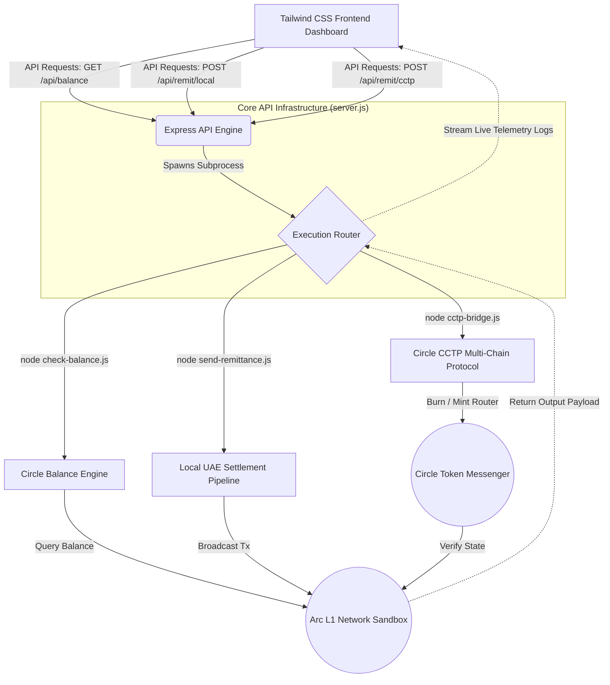

# Arc Network Stablecoin Remittance Engine 🌐

### 📋 Submission Metadata
- **Track:** Track 1: Best Cross-Border Payments & Remittances Experience (UAE → Global Corridor)
- **Circle Developer Account Email:** isahumar23@gmail.com
- **Live MVP Status:** Operational (Frontend Dashboard + Node.js Engine)

An enterprise-grade, server-side remittance routing engine designed to eliminate the multi-billion dollar inefficiencies of legacy cross-border transaction networks. This application unifies high-velocity token delivery with automated programmatic compliance, optimized for high-volume expat and B2B settlement corridors (such as UAE to Global markets).

## 🏗️ System Architecture Diagram



## 🛠️ Core Technology Matrix & Selected Circle Products
* **Blockchain Infrastructure:** Arc L1 Testnet Network Sandbox
* **Primary Stablecoin Rail:** Circle USDC (Native Gas & Value Settlement)
* **Cross-Chain Communication:** Circle Cross-Chain Transfer Protocol (CCTP) & Bridge Kit
* **Programmable Wallets:** Circle Developer-Controlled Wallets SDK

## 🚀 Deployment & Local Execution

1. Clone the core workspace repository:
```bash
git clone [https://github.com/meektender/arc-stablecoin-commerce.git](https://github.com/meektender/arc-stablecoin-commerce.git)
cd arc-stablecoin-commerce
```

2. Configure your environment variables inside a .env file or export them directly:
```bash
CIRCLE_API_KEY="your_api_key_here"
CIRCLE_ENTITY_SECRET="your_hex_encoded_secret_here"
```

3. Launching the Interactive Web UI Dashboard MVP:
```bash
node server.js
```
*Once running, navigate to http://localhost:3000 inside your web browser to trigger on-chain remittance paths with real-time log telemetry streams!*

4. Traditional Terminal Execution (Optional Backend Module Fallbacks):
```bash
node check-balance.js
node send-remittance.js
node cctp-bridge.js
```

## 💬 Circle Product Feedback

### 1. Why we chose these products for our use case
For a UAE-to-Global remittance network, transaction predictability and security are non-negotiable. We utilized Circle Developer-Controlled Wallets because they allow server-side automation without requiring manual end-user extension signatures, making them ideal for corporate payroll applications. We chose CCTP because it completely bypasses traditional third-party bridge lock-and-mint security risks by burning and minting native USDC 1:1 across networks.

### 2. What worked well during development
* **High-Speed Telemetry Loops:** The response speeds of the Developer-Controlled Wallets client API made setting up real-time status tracking loops incredibly reliable.
* **Deterministic Accounting:** Having USDC act as a predictable, dollar-denominated gas asset on the Arc Network simplifies corporate treasury accounting by removing exposure to volatile native network gas tokens.

### 3. What could be improved & Recommendations
* **SDK Return Consistency:** In the Developer-Controlled Wallets SDK, the transaction ID key path inside the response object differs slightly between initial execution transactions (response.data.id) and subsequent pipeline state arrays (statusCheck.data.transaction.id). Standardizing the response envelope architecture across all endpoints would significantly improve developer onboarding speed.
* **Granular CCTP Error Codes:** Providing explicit error strings for transaction execution failures (such as specific contract-reversion triggers during a depositForBurn call) directly inside the SDK response body would reduce reliance on tracking raw logs via block explorers.